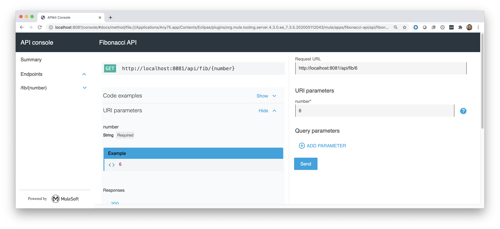
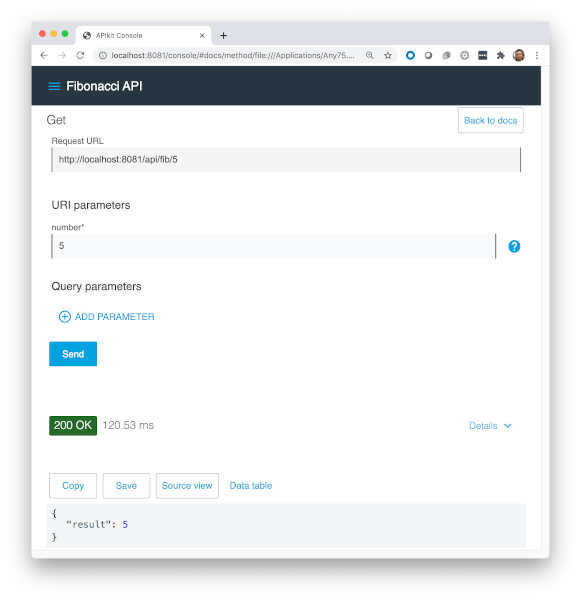
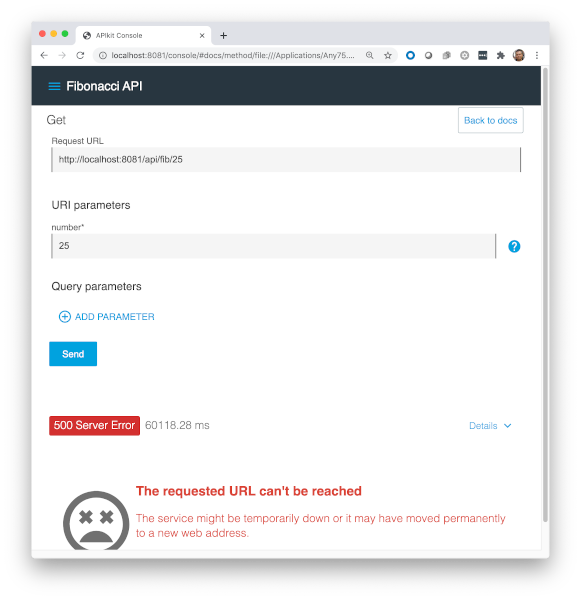

Fibonacci
===========

Na matemática, a série de Fibonacci é conhecida pela sequência:

    0, 1, 1, 2, 3, 5, 8, 13, ...

Podemos calcular os termos futuros com base nos anteriores. Por exemplo:

    0
    1
    1 = 1 + 0
    2 = 1 + 1
    3 = 2 + 1
    5 = 3 + 2
    8 = 5 + 3
    13 = 8 + 5

A definição é feita, portanto, da seguinte forma:

- F<sub>0</sub> = 0
- F<sub>1</sub> = 1
- F<sub>n</sub> = F<sub>n-1</sub> + F<sub>n-2</sub>

Assim, é possível determinar os próximos números da sequência: 21, 34, 55, ...


## Implementação

Existem várias formas de implementação: algumas mais eficientes e outras, menos.
Implementamos uma forma recursiva do algoritmo:


O serviço está implementado através de uma REST API: `GET /fib/{valor}`

O resultado é gerado na forma:

```json
{
    "result": Number
}
```

Os resultados podem ser simulados diretamente a partir do API Console.



O console está disponível em `http://localhost:8081/console`.


## Problema

Notamos que o app utilizou um mecanismo que demanda bastante recurso para
calcular uma simples série de Fibonacci. Existe um momento em que se atinge
o limite e a API retorna um erro HTTP 500.

| fib(1) = 1 | fib(5) = 5 |
|:----:|:----:|
|   |   |
| fib(10) = 55 | fib(15) = 610 |
|  |  | 
| fib(20) = 6765 | fib(25) = ??? |
|  |  | 


## Referências

Fibonacci number (Wikipedia): https://en.wikipedia.org/wiki/Fibonacci_number