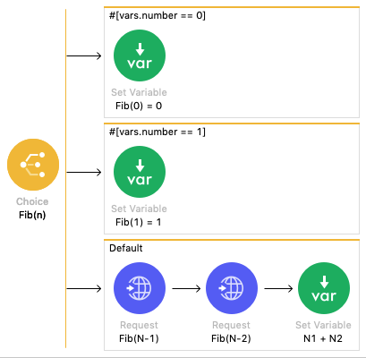

Fibonacci
===========

Na matemática, a série de Fibonacci é conhecida pela sequência:

    0, 1, 1, 2, 3, 5, 8, 13, ...

Podemos calcular os termos futuros com base nos anteriores. Por exemplo:

    0
    1
    1 = 1 + 0
    2 = 1 + 1
    3 = 2 + 1
    5 = 3 + 2
    8 = 5 + 3
    13 = 8 + 5

A definição é feita, portanto, da seguinte forma:

- F<sub>0</sub> = 0
- F<sub>1</sub> = 1
- F<sub>n</sub> = F<sub>n-1</sub> + F<sub>n-2</sub>


## Implementação

Existem várias formas de implementação: algumas mais eficientes e outras, menos.
Implementamos uma forma recursiva do algoritmo:



O serviço está implementado através de uma REST API: `GET /fib/{valor}`

O resultado é gerado na forma:

```json
{
    "result": <<RESULTADO>>
}
```


## Referências

Fibonacci number (Wikipedia): https://en.wikipedia.org/wiki/Fibonacci_number